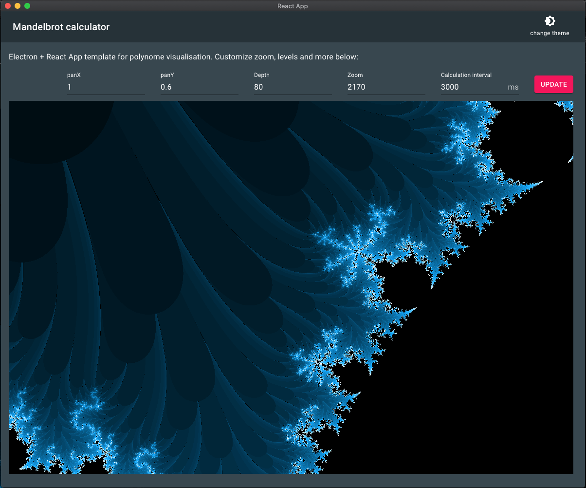

# Mandelbrot viewer

## Review locally:

### Run dev server: 

#### Install packages: 
`yarn install && yarn install:app`

#### Run Electron desktop app: 
`yarn electron-dev`

#### OR Run react app alone: 
`yarn start`

## Technical stack: 

Typescript, React.JS, redux, redux-sagas, electron.

