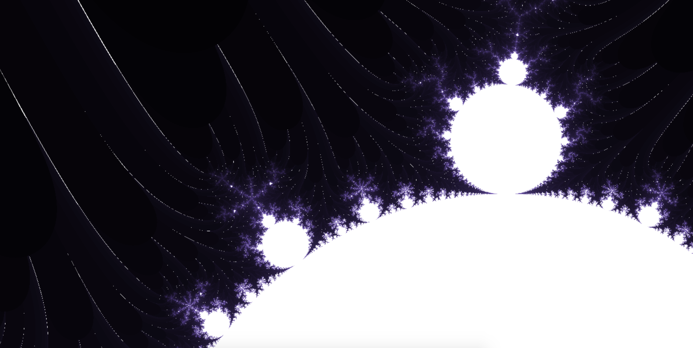
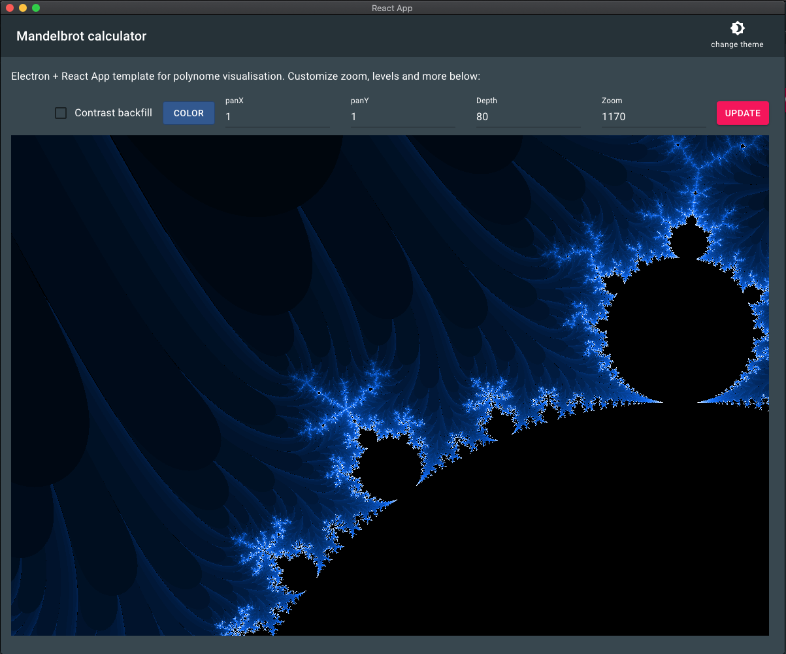
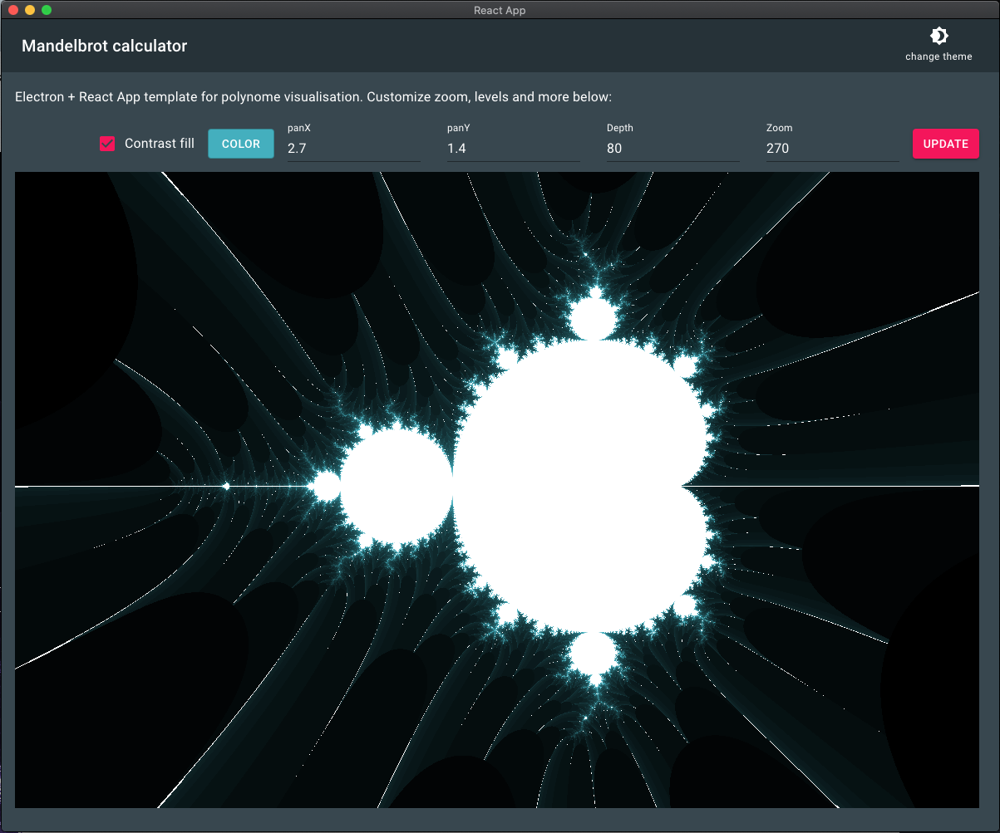
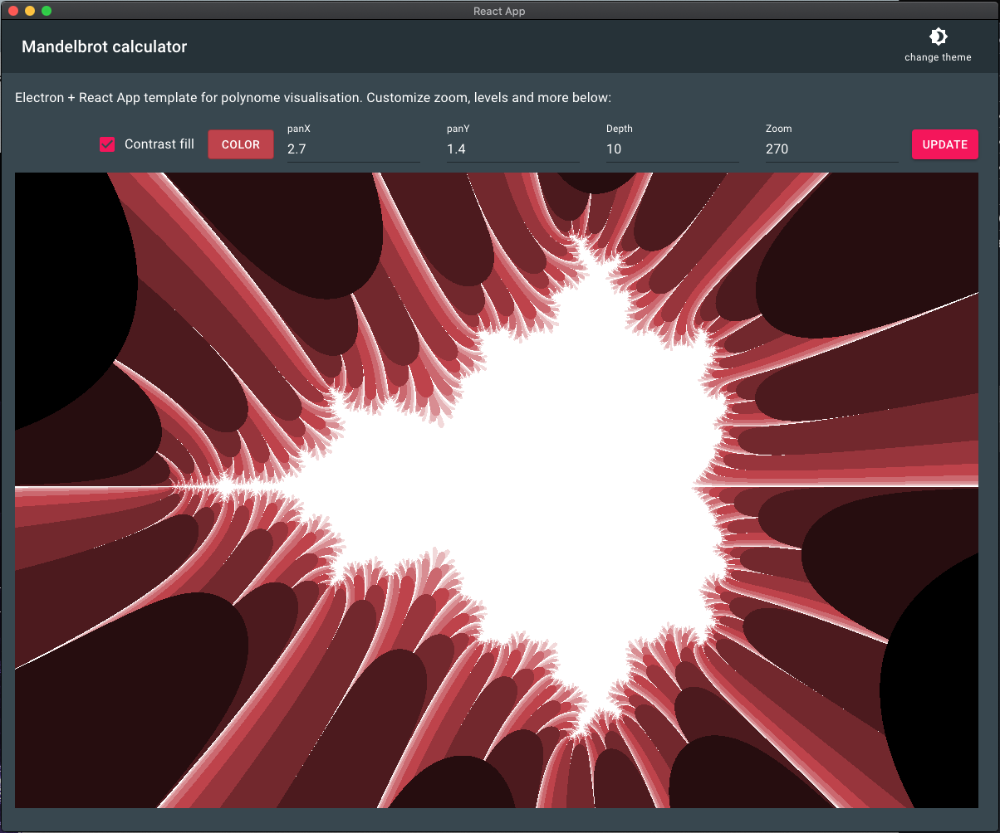

# Mandelbrot desktop renderer

## Review locally:

### Run dev server: 

#### Install packages: 
`yarn install && yarn install:app`

#### Run Electron desktop app: 
`yarn electron-dev`

#### OR Run react app alone: 
`yarn start`

## Technical stack: 

Typescript, React.JS, redux, redux-sagas, JavaScript, Electron.

## Screenshots:
* Dark theme;
* Contrast fill; 
* Low depth; 

         

## Variable description:

### Contrast fill
Use white pixel fill instead of default black #000;
### Color
Select preferred color and shade base.
### panX
Mandelbrot indentation by a coeficitient on X axis.
### panY
Mandelbrot indentation by a coeficitient on Y axis.
### Depth
Level count for the polynomial function, recommend to keep it low if computer starts lagging, or you experience delays.
### Zoom
Magnification rate for Mandelbrot view. Adjust panX and panY indexes too for best view.
